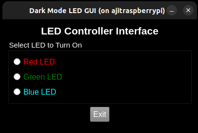

# Task 5.1 GUI - Raspberry Pi LED Controller (Button and Text Input Based)

This project is part of an embedded systems activity that involves building a graphical interface to control three LEDs connected to a Raspberry Pi using typed text input. The GUI is built using modern C++ and the Qt framework, and it interacts with GPIO pins using the `pigpio` library.

---

## Hardware Setup

### Components Required-

- Raspberry Pi (with GPIO headers)
- Breadboard
- 3 LEDs (Red, Green, Blue)
- 3 Resistors (220Ω – 330Ω)
- Jumper wires

### GPIO Pin Mapping-

| LED Color | GPIO Pin | Physical Pin |
|-----------|-----------|---------------|
| Red       | GPIO 17   | Pin 11        |
| Green     | GPIO 27   | Pin 13        |
| Blue      | GPIO 22   | Pin 15        |

### Circuit Instructions-

1. Connect the long leg (anode) of each LED to a resistor.
2. Connect the other end of each resistor to its assigned GPIO pin.
3. Connect the short leg (cathode) of each LED to the ground (GND).

## Build Instructions

1. SSH into your Raspberry Pi with X11 forwarding enabled:

   ```bash
   ssh -X user@<raspberrypi-ip>
   ```

2. Install dependencies (if not already installed):

   ```bash
   sudo apt install qt5-default qtbase5-dev qtbase5-dev-tools libpigpio-dev
   ```

3. Clone or copy this project to your Pi.

4. Navigate into the project folder:

   ```bash
   cd task5.1GUI
   ```

5. Build the application:

   ```bash
   qmake
   make
   ```

6. Run the GUI (ensure you use `sudo` to access GPIO and `XAUTHORITY` is passed):

   ```bash
   sudo env DISPLAY=$DISPLAY XAUTHORITY=/root/.Xauthority ./task5.1GUI
   ```

---

## Expected Output Radio Buttons



## Expected Output Text input


